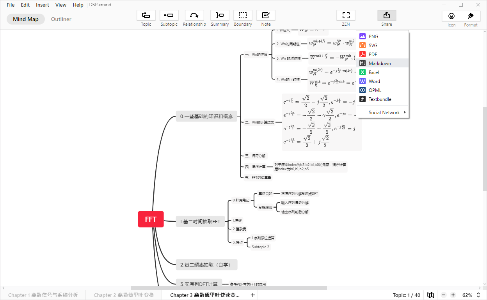

# xmind_to_WPEditor.md_converter

最近因为复习的原因，经常用Xmind做思维导图，然而发现Xmind导出的markdown格式思维导图和WPEditor.md的支援格式并不相同，因此写了这个小工具

## Requirement

Python >= 3.7

## Usage

From XMind Zen App, go to Share - markdown, save your mind app as FFT.md.



Simply run the command

```
python .\converter.py
```

The script will print convert result and save the result as save.md in the same folder.


Enjoy


## Comparison

